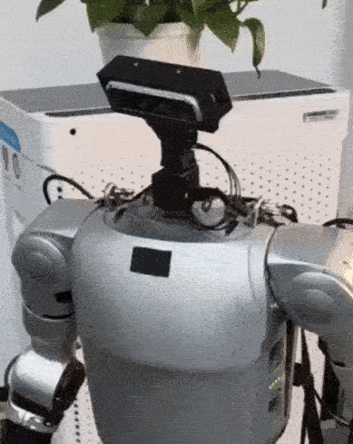
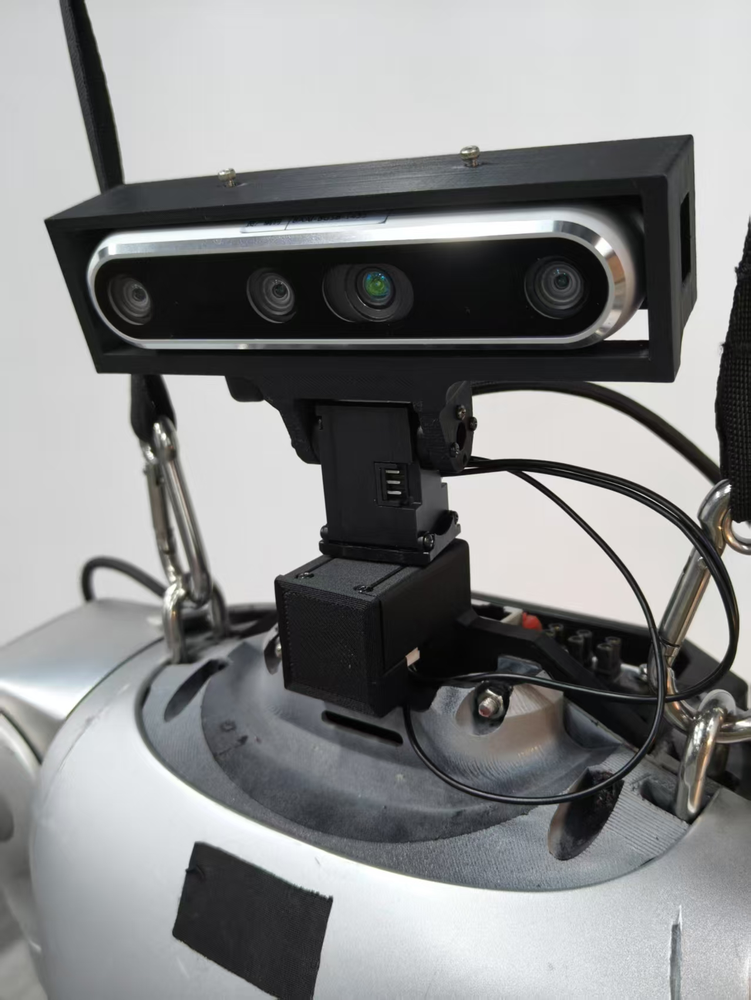
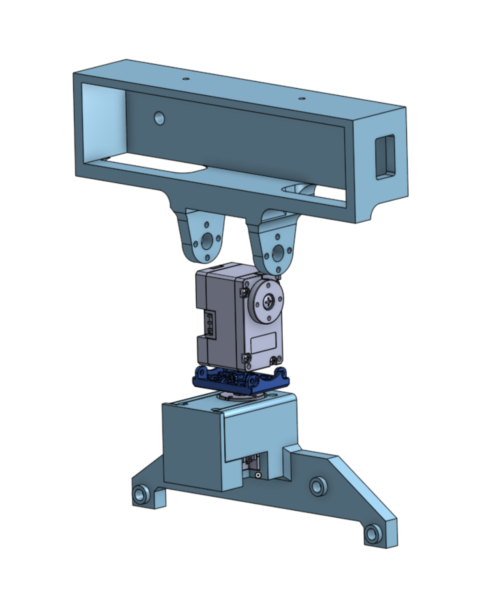

# open_2DOF_robot_head

Open-source 2-DOF robot head designs for research use across various robotic platforms.  
Modular, extensible, and continuously updated to support multiple robot types.

---

## G1 Platform Overview

### 📸 Visual Preview

   
  
  

### 📦 Bill of Materials (BOM)

| Component                            | Quantity | Notes                                              |
|-------------------------------------|----------|----------------------------------------------------|
| Dynamixel X330-series servo         | 2        | XL330 or XC330, one for yaw, one for pitch         |
| U2D2 communication board            | 1        | For USB-to-Dynamixel control                       |
| Dynamixel power hub or power board  | 1        | 5v or 12V, ensure compatibility with X330 series   |
|FPX330-S102 servo bracket	|1|	Connects yaw motor to pitch motor|
| PHS M2×8 TAP screws                 | 18       | Servo mounting                                     |
| PHS M2×4 TAP screws                 | 4        | Adaptor mounting                                   |
| Idler + Idler Cap + BTS M2.6×6 TAP  | 1 set    | Comes with XL330/XC330 package (idler kit)         |
| **3D Printed** (`neck_base.stl`)          | 1        | Mounts directly to robot chassis                   |
| **3D Printed** (`neck_base_shell.stl`)  | 1        | Covers and supports yaw motor                      |
| **3D Printed camera mount** (`camera_mount.stl`)          | 1        | Supports **Intel RealSense D455** and **ZED Mini** |
> 🛠️ 3D printing with **PLA+** or **PLA-CF** materials recommended for better rigidity and durability.

### 🧷 Assembly & Mounting Instructions

1. **Carefully remove** the original G1 robot head, including the camera and LiDAR ribbon cables.  
   ⚠️ **Be extremely cautious** when disconnecting internal wiring and PCBs—damage is your responsibility.

2. **Install `neck_base.stl`** onto the robot’s upper chassis and insert the **yaw motor** (Dynamixel X330 series).  
   Then **cover with `neck_base_shell.stl`** and secure using **six M2×8 TAP screws**.

3. **Mount the FPX330-S102** servo bracket onto the **yaw motor output horn**, using **four M2×4 TAP screws**.

4. Attach the **pitch motor** to the FPX330-S102 using **four M2×8 TAP screws**.

5. **Install the idler + idler cap** onto the pitch motor’s passive side (comes with motor kit).

6. **Fix the `camera_mount.stl`** to the pitch motor by aligning it with both the **idler** and **output horn**, using **eight screws**.

7. **Mount the camera module** (Intel RealSense D435, D455 or ZED Mini) into the camera mount.

8. **Connect both motors in a serial bus**, and plug into the **U2D2 communication board**, ensuring regulated **12V power** is supplied.
---

## Features

- **Two Degrees of Freedom**: Independent yaw and pitch rotation
- **Modular Design**: Easy to integrate and adapt across multiple robot platforms
- **3D Printable**: Compatible with common consumer-grade 3D printers
- **Motor Compatibility**: Designed for Dynamixel **XL330** series and **XC330** (same-size) motors
- **Flexible Mounting**: Standardized interfaces for easy replacement or experimentation

---

## 🚨‼️ Alert & Disclaimer

> ⚠️ **For Research Use Only**  
> These designs are intended strictly for **research and non-commercial use**. Please do not deploy them in any production, commercial, or safety-critical environment.

> ⚠️ **Caution When Replacing Original Robot Heads**  
> If you are using this design to replace an existing robot head, **please be extremely careful during disassembly**:
> - Always **power off the robot completely**
> - **Disconnect cables and PCBs with care** — fragile connectors, vision modules, or internal electronics can be easily damaged
> - **Any damage caused during disassembly or replacement is your own responsibility**

> ❗ We disclaim **all liability** for any damage, malfunction, or loss resulting from the use or installation of these models.

---

## Contributing

We welcome contributions! If you’ve adapted this head design for another robot, please:

1. Fork this repo
2. Create a new folder under the root directory
3. Add:
   - Your `.step` and `.stl` files
   - A `README.md` explaining mounting, power, and control integration
4. Submit a pull request!

---

## 📬 Contact

For questions, feedback, or collaboration:

**Chaoyi Xu**  
📧 chaoyi0027@gmail.com  
🌐 [co1one.github.io](https://co1one.github.io)